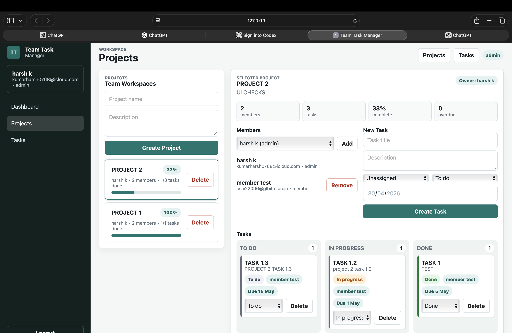
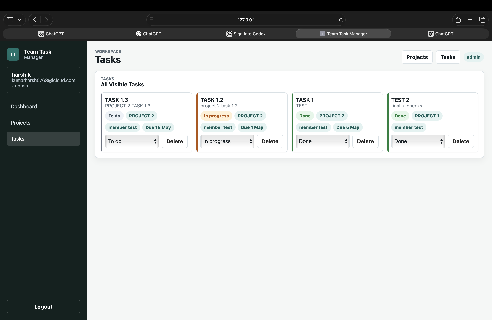
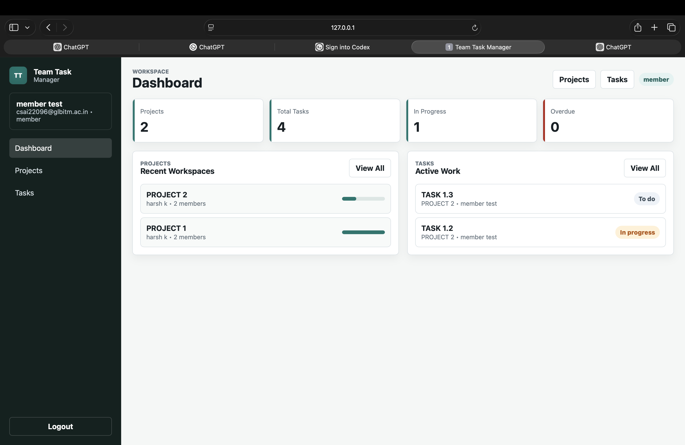

# Team Task Manager

A full-stack team task management web app built with **FastAPI**, **SQLite**, and a simple responsive frontend. Users can create projects, manage team members, assign tasks, track status, and view progress through role-based access control.


## Features

### Authentication

- User signup and login
- HTTP-only cookie-based sessions
- First registered user becomes `admin`
- Later users become `member`
- Logout support

### Role-Based Access

- Admin can create and delete projects
- Admin can add or remove project members
- Admin can create, assign, update, and delete tasks
- Members can view projects and tasks
- Members can update the status of tasks assigned to them

### Project Management

- Create projects with name and description
- View all projects from the Projects page
- See project owner, member count, task count, and completion progress
- Delete extra or completed projects

### Task Management

- Create tasks inside selected projects
- Assign tasks to team members
- Track task status: `To do`, `In progress`, and `Done`
- View due dates and overdue tasks
- See all visible tasks in one Tasks page

### Dashboard

- Summary cards for projects, total tasks, in-progress tasks, and overdue tasks
- Recent projects list
- Active work list
- Clean responsive UI for laptop and mobile screens

## Screenshots


### Dashboard


### Projects



### Tasks



### Member View



## Tech Stack

- Backend: Python, FastAPI
- Database: SQLite
- Frontend: HTML, CSS, JavaScript
- Authentication: Cookie-based sessions
- Deployment: Railway

## Project Structure

```text
.
├── app/
│   ├── main.py
│   └── static/
│       ├── index.html
│       ├── styles.css
│       └── app.js
├── docs/
│   └── screenshots/
├── requirements.txt
├── railway.json
├── Procfile
└── README.md
```

## Run Locally

### 1. Clone the repository

```bash
git clone <your-repo-url>
cd <your-repo-folder>
```

### 2. Create a virtual environment

```bash
python3 -m venv .venv
```

### 3. Activate the virtual environment

On macOS/Linux:

```bash
source .venv/bin/activate
```

On Windows:

```bash
.venv\Scripts\activate
```

### 4. Install dependencies

```bash
pip install -r requirements.txt
```

### 5. Start the app

```bash
uvicorn app.main:app --reload
```

### 6. Open in browser

```text
http://127.0.0.1:8000
```

## Demo Login Flow

Use this flow for testing and for the demo video:

1. Signup as the first user.
2. The first user automatically becomes `admin`.
3. Create a project.
4. Signup with a second email.
5. The second user becomes `member`.
6. Login as admin again.
7. Add the member to the project.
8. Create and assign tasks.
9. Login as member.
10. Update assigned task status.

## API Endpoints

### Auth

- `POST /api/auth/signup`
- `POST /api/auth/login`
- `POST /api/auth/logout`
- `GET /api/me`

### Users

- `GET /api/users`
- `PATCH /api/users/{user_id}/role`

### Projects

- `GET /api/projects`
- `POST /api/projects`
- `GET /api/projects/{project_id}`
- `DELETE /api/projects/{project_id}`
- `GET /api/projects/{project_id}/members`
- `POST /api/projects/{project_id}/members`
- `DELETE /api/projects/{project_id}/members/{user_id}`

### Tasks

- `GET /api/tasks`
- `GET /api/projects/{project_id}/tasks`
- `POST /api/projects/{project_id}/tasks`
- `PATCH /api/tasks/{task_id}`
- `DELETE /api/tasks/{task_id}`

### Dashboard

- `GET /api/dashboard`

## Deployment On Railway

This project includes a Railway start command in `railway.json`:

```bash
uvicorn app.main:app --host 0.0.0.0 --port $PORT
```

Railway provides the `PORT` environment variable automatically.

Deployment steps:

1. Push this project to GitHub.
2. Open Railway.
3. Create a new project.
4. Select deploy from GitHub repo.
5. Choose this repository.
6. Wait for the build to finish.
7. Open the service settings.
8. Go to Networking.
9. Generate a public domain.
10. Add the generated URL to the Live Demo section above.

## Submission Checklist

- Live Railway URL added
- GitHub repository public or accessible
- README updated with screenshots
- Demo video recorded
- Admin and member demo accounts tested
- Project creation tested
- Task assignment tested
- Member status update tested

## Demo Video Script

1. Show the login/signup page.
2. Signup as the first user and explain admin role.
3. Show the dashboard summary cards.
4. Create a project.
5. Add a member to the project.
6. Create tasks with different statuses.
7. Open the Tasks page and show the full task list.
8. Login as member.
9. Update the status of an assigned task.
10. End by showing the live Railway URL.

## Notes

- SQLite is used for simplicity and fast assignment development.
- The database file is ignored by Git through `.gitignore`.
- The frontend is intentionally simple and served directly by FastAPI.
